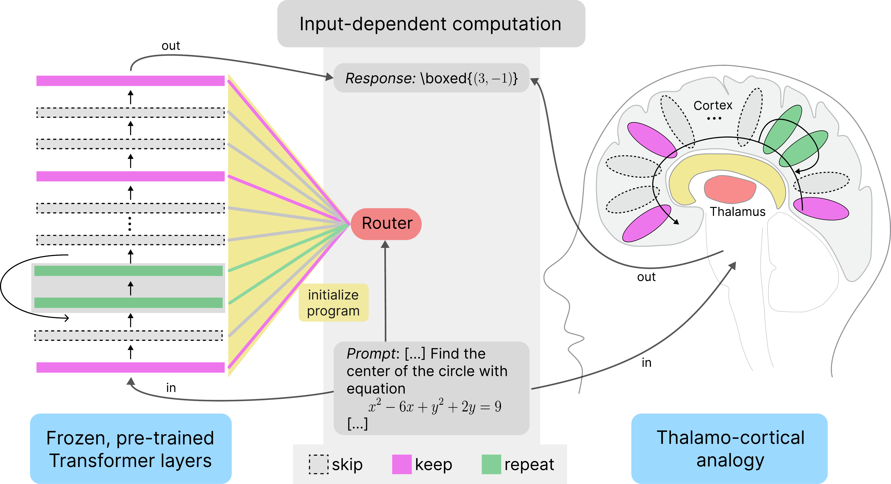
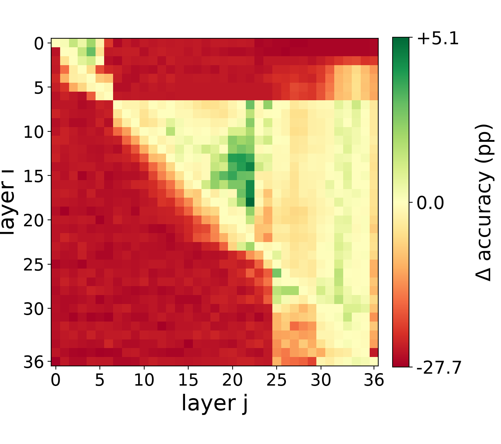
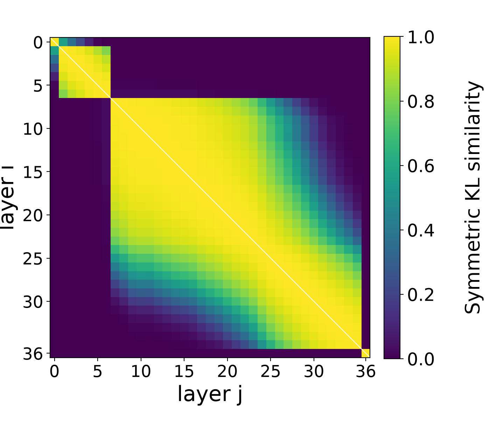
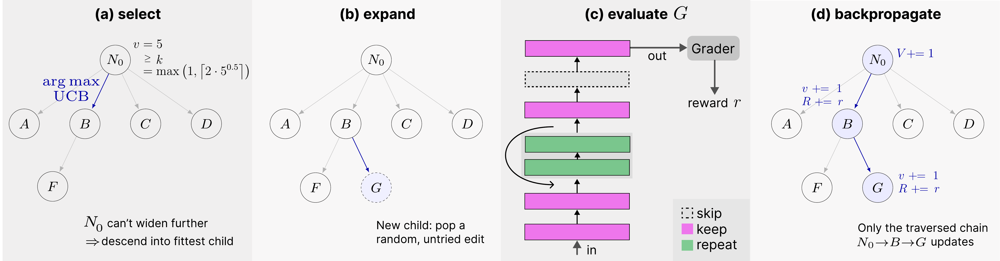
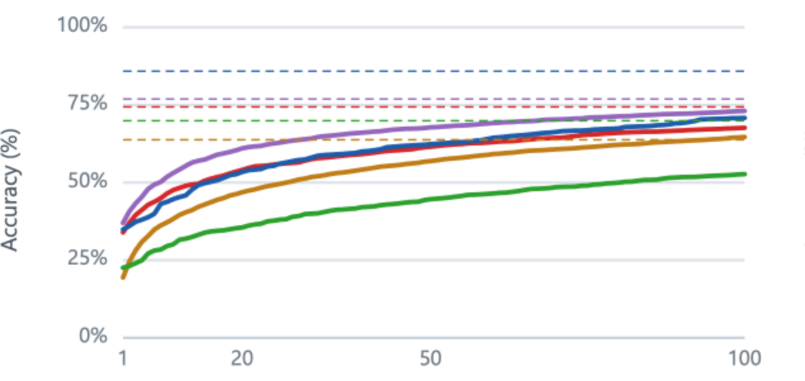

<h1 align="center">Re-PoLar</h1>

<p align="center">Code and data for <em>"Programs-of-Layers in LLMs through the Lens of Cortical Areas"</em> — a reproduction and extension of <a href="https://arxiv.org/abs/2606.06574">PoLar</a> (Li et al.).</p>

<p align="center">[<a href="https://datexis.github.io/RE-PoLar/">Project Page</a>] [<a href="https://arxiv.org">Paper (soon)</a>]</p>

<p align="center"></p>

LLM inference conventionally runs every input through every transformer
layer, in the same fixed order. PoLar showed a per-input *program* of layer
skips/repeats, found by Monte Carlo Tree Search (MCTS), can do better, and
that a small router can predict a good program directly, without running the
search at inference time. This repo reproduces that search and router across
5 models and releases the ~10M programs it found (979k valid, 9.1M
invalid, across 50k questions). We reproduce several of PoLar's core
findings (skip beats standard pass, repeat beats skip, combining both
beats either alone), and read the router's coordinating role as
functionally analogous to how the thalamus routes computation across
cortical areas.

## Motivation

As a prestudy, inspired by David Noel Ng's
[blog post](https://dnhkng.github.io/posts/rys/), we asked whether layers
of a pretrained LLM tolerate rerouting at inference time. Both tested on
Qwen3-8B, a 6-domain subset of MMLU-Pro:

<p align="center"> </p>

Layer 6 is a critical boundary in both: mixing layers from before and after
it collapses accuracy under repeat/skip (left), matching a sharp similarity
boundary at the same layer (right). The same holds past layer 25: layers
there are mutually similar (right) and tolerate being skipped (left), with a
well-chosen middle block (layers 18-22) even net positive under repeat.
Reproduced by [`prestudy/`](prestudy/).

## Setup

```bash
python -m venv .venv && source .venv/bin/activate
pip install -r requirements.txt
```

## Method

The method, in three parts:

- **Program**: partitions the model's `D` layers into contiguous segments
  of at most 4 layers, each assigned `keep` (run once), `skip` (remove), or
  `repeat` (run twice). All-`keep` is the identity, the standard forward
  pass. [`re_polar/core/ir.py`](re_polar/core/ir.py)
- **Search**: MCTS over per-question edits to the identity program;
  reward is 1 if the resulting program answers correctly, 0 otherwise. UCB
  selection with a length penalty (discourages needlessly long programs)
  plus progressive widening. [`re_polar/mcts/search.py`](re_polar/mcts/search.py),
  [`re_polar/mcts/scheduler.py`](re_polar/mcts/scheduler.py)
- **Router**: a frozen text embedding model (Qwen3-Embedding-0.6B) encodes
  the input; learnable per-layer query embeddings cross-attend against the
  token representations; a small transformer encoder adds context across
  depth; two linear heads predict segment boundaries and each segment's
  operation. [`re_polar/router/model.py`](re_polar/router/model.py),
  [`re_polar/router/train.py`](re_polar/router/train.py)

<p align="center"></p>

## Data

`re_polar/mcts/` discovered ~10M programs (979k valid, 9.1M invalid) for
~50,000 questions across 5 models (Qwen3-8B,
Qwen3-32B, Qwen2.5-3B, Qwen2.5-7B, Qwen1.5-MoE-A2.7B) and 5 DART-Math
difficulty tiers (2000 questions each). This is what the router is trained
on and the structural analysis is built from. The full data ships in this
repo, format and layout documented in [`data/`](data/DATA.md).

## Results

Skip and repeat combined beat either alone, on every model and DART-Math
difficulty (shown here at difficulty 1). Base = identity already correct;
Skip/Loop = identity or a skip-only/repeat-only valid program exists;
Skip&Loop = identity or any valid program exists, all measured over the
MCTS-search pool (all 2000 DART-Math questions per difficulty):

<div align="center">

| model | Base | Skip | Loop | Skip&Loop | Gain |
|---|---|---|---|---|---|
| Qwen1.5-MoE-A2.7B | 22.7% | 34.8% | 67.1% | 73.0% | +50.2 |
| Qwen2.5-3B | 31.6% | 54.8% | 76.5% | 82.7% | +51.0 |
| Qwen2.5-7B | 50.0% | 65.4% | 84.9% | 89.0% | +39.0 |
| Qwen3-8B | 48.6% | 67.3% | 83.8% | 88.8% | +40.2 |
| Qwen3-32B | 62.5% | 84.4% | 94.8% | 97.1% | +34.6 |

</div>

Computed by [`re_polar/mcts/analysis/polar_comparison.py`](re_polar/mcts/analysis/polar_comparison.py)'s
`compute_skip_loop_accuracy`.

<p align="center"></p>

Menu coverage: rank non-identity programs by how many questions they solved
during search, then, for each menu size K, execute the top-K of those
against every question and measure what fraction they solve. A small menu
already covers most questions. See
[`analysis/mcts_design/menu_coverage.py`](analysis/mcts_design/menu_coverage.py).
Router accuracy and program-structure analysis are under
[`analysis/`](analysis/); see the paper for the full results.

## Quickstart

Build a DART-Math train/val/test split (MATH+GSM8K, difficulty 1-5):

```bash
python -m re_polar.datasets.dart_math --out-dir ./data/dart_math --include-gsm8k
```

Join question text onto the released MCTS data, then train a router:

```bash
python -m re_polar.datasets.attach_mcts_questions \
    --mcts-dir data/mcts_results --dart-math-dir ./data/dart_math \
    --out-dir ./data/mcts_results_full

python -m re_polar.router.train \
    --samples data/mcts_results_full/qwen3_8b/dart-math-diff-1/merged_mcts_samples.json \
    --model qwen3_8b --out ./results/router_qwen3_8b.pt
```

Evaluate a trained router against the identity-program baseline:

```bash
python -m re_polar.router.infer \
    --checkpoint ./results/router_qwen3_8b.pt --model qwen3_8b \
    --data-dir ./data/dart_math --difficulty all \
    --output ./results/infer_qwen3_8b.json
```

The search that *discovers* this data ships as a library
([`re_polar/mcts/run_search_dart_math.py`](re_polar/mcts/run_search_dart_math.py),
[`re_polar/mcts/run_search_mmlu_pro_domains.py`](re_polar/mcts/run_search_mmlu_pro_domains.py)),
not a one-shot script.

## Citation

```bibtex
@article{westerhoff2026repolar,
      title={Programs-of-Layers in LLMs through the Lens of Cortical Areas},
      author={Westerhoff, Justus and Olbrich, Stephan and Oraby, Hatem and Larkum, Matthew Evan and Gers, Felix},
      journal={arXiv preprint arXiv:TODO},
      year={2026},
      note={Preprint / under review -- citation details not yet final}
}
```

Machine-readable version: [`CITATION.cff`](CITATION.cff).

## License

[MIT](LICENSE). Third-party data/code this project depends on is listed in
[`NOTICE.md`](NOTICE.md).
